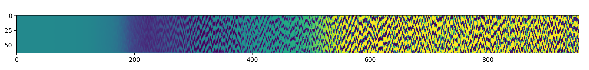

# trajectory_transformer

Experiments with model learning from trajectories. I'm interested in learning a latent representation where not every timestep corresponds to a transition in the latent dynamics.



In this image, each column corresponds to a trajectory (from top to bottom). The intensity of each pixel value is the probability that a timestep in the input trajectory corresponds to a timestep in the latent trajectory -- yellow means a new action is taking place, and purple means a continuation of the previous action. In the model, these are the _alphas_.

## Setup

Get the repo and submodules

```
git clone https://github.com/IzzyBrand/trajectory_transformer.git
cd trajectory_transformer
git submodule init
git submodule update
```

Setup and activate virtualenv

```
virtualenv -p python3.7 venv
source venv/bin/activate
pip install -r requirements.txt
```

## Running the thing

To train the trajectory-autoencoder thingy, from within the base directory and with the virtualenv active, run `python train.py`. You can press `ctrl-c` after a few epochs, which stops training early.


## Generating more training data
Depending on which domain you run, `train.py` will look for data in `data/Bipepdalalker-v2` or `data/CarRacing-v0`. I've included one trajectory for each domain to keep the repo small, but you will likely want to generate more data.

To generate trajectories I'm using pretrained models I found in some repos (see `external` folder). Conveniently, both external repos have a `test.py` file which runs the pre-trained models. To save that data in a standardized format, I wrote a logging class in `external/log.py`. To use this you'll need to make a few changes to the `test.py` file:

1. Add `import os; import numpy as np; import h5py`
2. Copy in the `Log` class somewhere. I didn't want to mess with the relative imports.
3. Add `log = Log(env_name)` before the episode loop (sets up the logger).
4. Add `log.reset()` before the inner loop (clears previous episode).
5. Add `log.add(state, action)` in the loop (save a state action tuple).
6. Add `log.save()` after below the inner loop (write out the trajectory).
